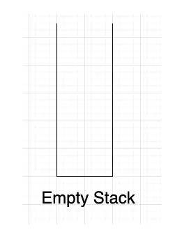

En ciencias de la computación, las estructuras de datos son conceptos fundamentales para organizar y organizar los datos de manera eficiente. Dentro de esas estructuras podemos observar las pilas y colas. A continuación, vamos a describir cada una.

## Pilas

Las pilas son estructuras de datos lineales que siguen el principio **LIFO (Last In, First Out)**, lo que significa que el último elemento agregado a la pila es el primero es ser removido. Para entenderlo de mejor manera podemos visualizarlo como una pila de platos donde el último plato que colocamos en la parte superior es el primer plato en salir (se remueve de la parte superior).

### Operaciones donde hacemos uso de **pilas**

- **push**: Agrega un elemento a la parte superior de la pila
- **pop**: Elimina un elemento de la parte superior de la pila  
- **peek**: Retorna un elemento de la parte superior de la pila sin eliminar dicho elemento

### Ejemplo gráfico

Vamos a empezar con una pila vacía

Vamos a agregar el primer elemento a la pila, en este el 10

## Colas

Las colas son estructuras de datos lineales que siguen el principio **FIFO (First In, First Out)**, lo que significa que el primer elemento que agregamos a la cola es el primer elemento en ser removido. Para visualizarlo de mejor manera, pensemos en una fila de banco, la primer persona que llegó es la primer persona en ser atendida

### Operaciones donde hacemos uso de **colas**

- **Enqueue**: Agrega un elemento al final (posterior) de la cola.
- **Dequeue**: Elimina y devuelve el elemento frontal de la cola.
- **Front (o Peek)**: Devuelve el elemento frontal de la cola sin eliminarlo.

## Diferencias entre pilas y colas

Las principales diferencias las podemos apreciar en la siguiente tabla

| ---------------       | ---------------                                     | ---------------                                                        |
| Característica        | Pila                                                | Cola                                                                   |
| Definición            | Estructura de Datos Lineal que usa **LIFO**         | Estructura de Datos Lineal que usa **FIFO**                            |
| Operaciones Primarias | **push**, **pop**, **peek**                         | **Enqueue**, **Dequeue**, **Rear**, **Front**                          |
| Inserción/Eliminación | Los elementos se agregan o eliminan al final (top)  | Los elementos se agregan en la parte trasera y se eliminan al frente   |
| Ejemplos              | Historial del navegador (botón regresar o atrás)    | tareas programadas de CPU                                              |
| Implementación        | Se pueden implementar con arrays o listas enlazadas | Se pueden implementar con arrays, listas anidadas o buffers circulares |
