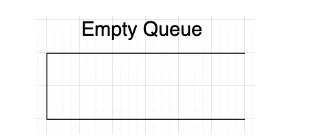
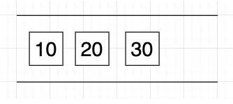
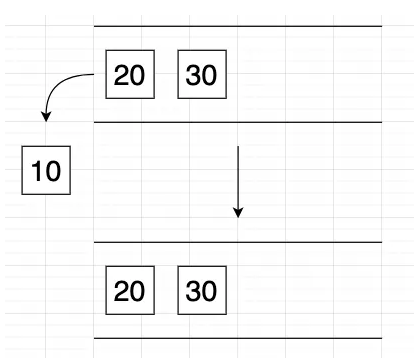

En ciencias de la computación, las estructuras de datos son conceptos fundamentales para organizar y organizar los datos de manera eficiente. Dentro de esas estructuras podemos observar las pilas y colas. A continuación, vamos a describir cada una.

## Pilas

Las pilas son estructuras de datos lineales que siguen el principio **LIFO (Last In, First Out)**, lo que significa que el último elemento agregado a la pila es el primero es ser removido. Para entenderlo de mejor manera podemos visualizarlo como una pila de platos donde el último plato que colocamos en la parte superior es el primer plato en salir (se remueve de la parte superior).

### Operaciones donde hacemos uso de **pilas**

- **push**: Agrega un elemento a la parte superior de la pila
- **pop**: Elimina un elemento de la parte superior de la pila  
- **peek**: Retorna un elemento de la parte superior de la pila sin eliminar dicho elemento

### Ejemplo gráfico

Vamos a empezar con una pila vacía


Vamos a agregar el primer elemento a la pila, en este el 10


Ahora vamos a agregar el 20, para agregar el 20 hay que tener en cuenta que el 10 cae al fondo de la pila, es decir, el 10 se convierte en el primer elemento de la pila, si agregamos el 20 quedaría de la siguiente manera:


Siguiendo la misma lógica aplicada para el 20 ahora vamos a agregar el 30, quedando de la siguiente manera:


La pila actual desde el fondo hasta la parte superior quedaría de la siguiente manera 10, 20 y 30. Si nosotros quisieramos eliminar el 10, en este caso no podríamos debido a que tenemos tanto el 30 como el 20 en medio, por lo tanto, es necesario eliminar primero desde la parte superior hasta llegar al fondo. Para este ejemplo en particular vamos a tener que eliminar el 30 luego el 20 y al final el 10 aplicando **LIFO (First In Last Out)**, es decir, 10 fue el primero en entrar a la pila pero el último en salir, veamos el ejemplo de manera gráfica con imágenes


Ahora vamos a eliminar el 20 de la pila


Ahora vamos a eliminar el último elemento de la pila en este caso el 10


De esta manera hemos agregado y eliminado elementos de la pila

## Colas

Las colas son estructuras de datos lineales que siguen el principio **FIFO (First In, First Out)**, lo que significa que el primer elemento que agregamos a la cola es el primer elemento en ser removido. Para visualizarlo de mejor manera, pensemos en una fila de banco, la primer persona que llegó es la primer persona en ser atendida

### Operaciones donde hacemos uso de **colas**

- **Enqueue**: Agrega un elemento al final (posterior) de la cola.
- **Dequeue**: Elimina y devuelve el elemento frontal de la cola.
- **Front (o Peek)**: Devuelve el elemento frontal de la cola sin eliminarlo.

### Ejemplo gráfico

Ahora veamos un ejemplo de como funcionan las colas.

Cola vacía



Ahora vamos a agregar los elementos 10, 20 y 30 a la cola en ese orden. En este caso vamos a agregarlas usando **push** de la siguiente manera

```js
const queue = [];

queue.push(10);
queue.push(20);
queue.push(30);

console.log(queue) // [10, 20, 30]
```

La cola quedaría de la siguiente manera:



Ahora vamos a eliminar los elementos, vamos a eliminar el elemento 10, quedaría de la siguiente manera



Esto lo podemos ver reflejado en JavaScript mediante el siguiente código

```js
queue.shift()
console.log(queue) // [20, 30]
```

Si nosotros queremos eliminar todos los elementos (20 y 30) vamos a seguir los pasos anteriores como se puede ver en el siguiente código

```js
queue.shift()
queue.shift()
console.log(queue) // []
```

De está manera la cola queda vacía, y se aplica **FIFO (First In First Out)**, es decir, eliminamos primero el 10, luego el 20 y al final el 30 se eliminan en el mismo orden que entraron.
